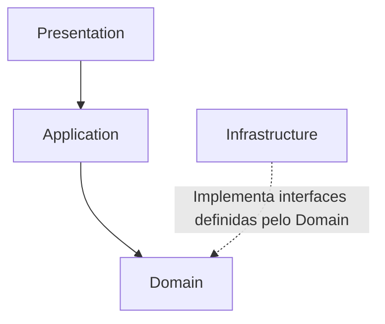
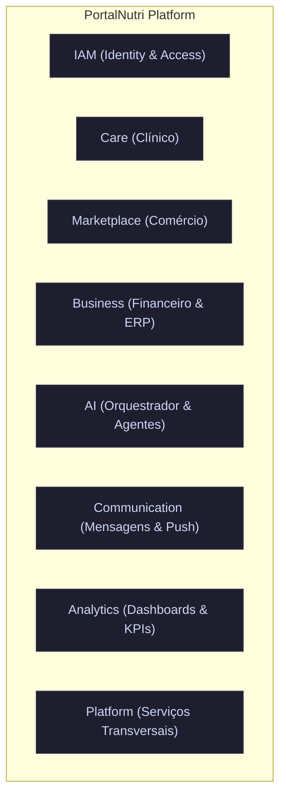

# PortalNutri Platform

## Master Architecture

**Versão:** 1.0

**Status:** Documento Mestre de Arquitetura

---

# 00. Objetivo

Este documento define oficialmente a Arquitetura do PortalNutri Platform.

Seu objetivo é estabelecer os princípios arquiteturais que orientarão toda a construção técnica da plataforma, garantindo organização, escalabilidade, segurança, manutenibilidade e evolução contínua.

Este documento não define tecnologias específicas.

A escolha de linguagens, frameworks, bancos de dados, provedores de nuvem ou ferramentas de infraestrutura poderá evoluir ao longo do tempo sem alterar os princípios arquiteturais aqui estabelecidos.

Este documento descreve exclusivamente:

- A organização estrutural da plataforma.
- Os princípios arquiteturais.
- A separação entre domínios.
- A comunicação entre os componentes.
- A organização das camadas da aplicação.
- Os mecanismos de escalabilidade.
- As diretrizes de segurança.
- Os padrões de evolução da arquitetura.

Toda implementação técnica deverá respeitar obrigatoriamente este documento.

A Arquitetura representa a fundação técnica da plataforma.

O código deverá ser apenas uma implementação da arquitetura aqui definida.

---

## Princípio Fundamental

A Arquitetura do PortalNutri deverá priorizar simplicidade, desacoplamento, escalabilidade e clareza estrutural.

Toda decisão arquitetural deverá preservar a independência entre os domínios de negócio e permitir evolução contínua da plataforma sem comprometer sua estabilidade.

---

## Objetivo Final

Construir uma arquitetura suficientemente organizada para permitir que o PortalNutri evolua continuamente durante muitos anos, suportando crescimento funcional, aumento de usuários, novas integrações, novos domínios de negócio e novas tecnologias, preservando sempre a consistência da plataforma.

---

# 01. Filosofia Arquitetural

A Arquitetura do PortalNutri deverá ser construída priorizando simplicidade, organização, escalabilidade e evolução contínua.

Toda decisão arquitetural deverá preservar a independência dos domínios de negócio, reduzir acoplamentos desnecessários e facilitar a manutenção da plataforma ao longo dos anos.

A Arquitetura representa a tradução técnica do Modelo de Negócio definido no master_domain_model.md.

Nenhuma decisão técnica poderá contrariar os princípios estabelecidos pelos documentos mestres da plataforma.

---

## Organização por Domínios

O PortalNutri será organizado por Domínios de Negócio independentes.

Cada domínio possuirá responsabilidades, regras, processos e evolução próprios.

A estrutura técnica deverá refletir exatamente a estrutura do negócio.

Os principais Bounded Contexts da plataforma são:

- IAM
- Care
- Marketplace
- Business
- AI
- Communication
- Analytics
- Platform

Cada Bounded Context possui responsabilidade exclusiva sobre seus conceitos de negócio, conforme definido em master_bounded_contexts.md.

---

## Modular Monolith

O PortalNutri será desenvolvido inicialmente utilizando uma arquitetura **Modular Monolith**.

Cada domínio será implementado como um módulo independente dentro da mesma aplicação, preservando limites claros de responsabilidade e comunicação.

Essa abordagem permitirá:

- Simplicidade operacional.
- Maior produtividade.
- Facilidade de manutenção.
- Evolução incremental.
- Alto desempenho na comunicação entre módulos.
- Menor complexidade de infraestrutura.

A arquitetura deverá permitir que qualquer domínio possa ser extraído futuramente para uma arquitetura distribuída, caso exista necessidade técnica ou de negócio.

---

## Domain-Driven Design (DDD)

A organização da plataforma seguirá os princípios de **Domain-Driven Design (DDD)**.

O domínio do negócio será sempre o principal direcionador da arquitetura.

Toda implementação deverá refletir os conceitos, participantes, regras e linguagem oficial definidos no master_domain_model.md.

A linguagem utilizada no código deverá permanecer consistente com o Glossário Oficial do Domínio.

---

## Clean Architecture

Cada domínio deverá ser organizado utilizando os princípios da **Clean Architecture**.

As regras de negócio deverão permanecer independentes de:

- Frameworks.
- Banco de Dados.
- Interfaces.
- APIs.
- Serviços externos.
- Provedores de infraestrutura.

A tecnologia deverá servir ao domínio, e nunca o contrário.

---

## Evolução Contínua

A arquitetura deverá permitir evolução gradual sem necessidade de reestruturações profundas.

Novas funcionalidades deverão ser incorporadas respeitando a organização existente, preservando compatibilidade e estabilidade da plataforma.

---

## Independência Tecnológica

A Arquitetura do PortalNutri não dependerá de tecnologias específicas.

Frameworks, linguagens de programação, bancos de dados e provedores de infraestrutura poderão ser substituídos ao longo do tempo sem comprometer os princípios arquiteturais definidos neste documento.

---

## Princípio Fundamental

A Arquitetura do PortalNutri deverá refletir fielmente o Modelo de Negócio da plataforma.

O domínio sempre terá prioridade sobre a tecnologia.

Toda evolução arquitetural deverá preservar simplicidade, organização, baixo acoplamento e capacidade de crescimento contínuo.

---

# 02. Comunicação entre Domínios

A comunicação entre os domínios do PortalNutri deverá preservar o baixo acoplamento, a clareza arquitetural e a independência evolutiva de cada domínio de negócio.

Nenhum domínio poderá acessar diretamente a implementação interna de outro domínio.

A comunicação deverá ocorrer exclusivamente por meio de contratos públicos, serviços expostos oficialmente ou eventos de domínio.

---

## Princípio da Dependência Unidirecional

Um domínio não deverá depender da estrutura interna de outro domínio.

Cada domínio deverá proteger suas regras, entidades, casos de uso e infraestrutura.

Quando um domínio precisar interagir com outro, deverá utilizar apenas interfaces públicas, contratos definidos ou eventos publicados.

---

## Comunicação Síncrona

A comunicação síncrona entre Bounded Contexts deverá ocorrer exclusivamente através da Camada de Aplicação.

A Camada de Aplicação disponibilizará:

- Commands;
- Queries;
- Workflows.

Nenhum Bounded Context poderá acessar diretamente o Domínio de outro Bounded Context.

Essa comunicação deverá ser utilizada quando um domínio precisar de uma resposta imediata para concluir sua operação.

---

## Comunicação Assíncrona

A comunicação assíncrona deverá ocorrer através de Eventos de Domínio.

Eventos representam fatos relevantes que já aconteceram dentro da plataforma.

Exemplos:

- PacienteCriado
- ConsultaAgendada
- ExameRecebido
- ProtocoloAprovado
- PedidoCriado
- PagamentoConfirmado
- ProdutoPublicado
- AssinaturaAtivada

Os domínios interessados poderão reagir a esses eventos sem que o domínio de origem conheça seus consumidores.

---

## Eventos de Domínio

Todo evento de domínio deverá representar algo que já ocorreu.

Eventos não devem representar comandos ou intenções futuras.

Correto:

- PacienteCriado
- PagamentoConfirmado
- ExameDisponibilizado

Incorreto:

- CriarPaciente
- ConfirmarPagamento
- EnviarExame

---

## Isolamento entre Domínios

Cada domínio deverá ser responsável por suas próprias regras de negócio.

Um domínio não poderá modificar diretamente dados internos de outro domínio.

Quando uma alteração for necessária, deverá solicitar a operação através de contrato público ou reagir a eventos publicados.

---

## Evolução para Microsserviços

A comunicação por contratos públicos e eventos deverá permitir que, no futuro, qualquer domínio possa ser extraído para um microsserviço independente sem ruptura da arquitetura.

A arquitetura deverá nascer modular mesmo funcionando inicialmente como Modular Monolith.

---

## Princípio Fundamental

Os domínios do PortalNutri deverão colaborar sem se acoplar.

Toda comunicação deverá preservar autonomia, clareza, rastreabilidade e possibilidade de evolução futura da plataforma.

Toda comunicação entre Contextos deverá respeitar o Authorization Engine quando envolver acesso a informações protegidas.

---

# 03. Organização Interna dos Domínios

Cada Domínio do PortalNutri deverá possuir uma organização interna padronizada, preservando independência, baixo acoplamento e alta coesão.

A estrutura interna dos domínios deverá seguir os princípios da Clean Architecture, permitindo que as regras de negócio permaneçam isoladas das tecnologias utilizadas.

Todos os domínios deverão possuir a mesma organização estrutural, facilitando manutenção, evolução e entendimento da plataforma.

---

## Estrutura Geral

Cada domínio deverá ser organizado nas seguintes camadas:

- Domain
- Application
- Infrastructure
- Presentation

Cada camada possuirá responsabilidades específicas e bem definidas.

---

## Domain

O Domain representa o núcleo do negócio.

Nesta camada deverão existir exclusivamente regras de negócio e conceitos do domínio.

Exemplos:

- Entidades
- Value Objects
- Aggregates
- Eventos de Domínio
- Serviços de Domínio
- Interfaces de Repositórios
- Regras de Negócio

O Domain não poderá depender de frameworks, bancos de dados, APIs ou qualquer tecnologia externa.

---

## Application

A camada de Application será responsável por orquestrar os casos de uso da plataforma.

Ela deverá coordenar a execução das regras de negócio, sem implementá-las diretamente.

Exemplos:

- Casos de Uso
- Commands
- Queries
- Handlers
- Workflows
- DTOs

A camada de Application poderá utilizar o Domain, mas nunca alterar suas responsabilidades.

---

## Infrastructure

A Infrastructure será responsável pela implementação das dependências externas.

Exemplos:

- Banco de Dados
- Repositórios
- APIs Externas
- Serviços de Mensageria
- Cache
- Serviços de Arquivos
- Configurações Técnicas
- Integrações

Nenhuma regra de negócio deverá existir nesta camada.

---

## Presentation

A camada Presentation representa apenas um dos consumidores da Camada de Aplicação.

Outros consumidores incluem:

- Frontend Web.
- Aplicativos Mobile.
- APIs REST.
- GraphQL.
- Inteligência Artificial.
- Webhooks.
- Jobs.
- Integrações externas.

Todos deverão utilizar exatamente os mesmos Casos de Uso disponibilizados pela Camada de Aplicação.

A Presentation não deverá implementar regras de negócio.

Sua função será apenas receber solicitações, encaminhá-las à camada de Application e apresentar os resultados.

---

## Fluxo de Dependências

O fluxo de dependências entre as camadas é representado pelo diagrama a seguir:



Embora faça parte da arquitetura, a Infrastructure não participa do fluxo principal de dependências.

Sua responsabilidade é fornecer implementações concretas para as interfaces definidas pelo Domain, permitindo que as regras de negócio permaneçam independentes das tecnologias utilizadas.

Dessa forma, o fluxo de execução da aplicação permanece distinto da direção das dependências de código, conforme os princípios da Clean Architecture.

O Domain nunca poderá depender de qualquer outra camada.

---

## Independência Tecnológica

A organização interna dos domínios deverá permitir substituição de tecnologias sem impacto nas regras de negócio.

Mudanças em banco de dados, frameworks, provedores de infraestrutura ou protocolos de comunicação não deverão exigir alterações no Domain.

---

## Padronização

Todos os domínios da plataforma deverão seguir exatamente o mesmo padrão estrutural.

Essa padronização facilitará:

- Evolução da plataforma.
- Reutilização de conhecimento.
- Onboarding de novos desenvolvedores.
- Revisões de código.
- Testes.
- Documentação.
- Manutenção.

---

## Princípio Fundamental

O código deverá refletir a organização do negócio.

As regras de negócio deverão permanecer no centro da arquitetura, independentes das tecnologias utilizadas pela plataforma.

---

# 04. Bounded Contexts

A arquitetura do PortalNutri será organizada em Bounded Contexts, garantindo que cada domínio possua limites claros de responsabilidade, linguagem própria e propriedade exclusiva sobre seus conceitos centrais.

Cada conceito da plataforma deverá possuir um único domínio responsável por sua gestão.

Nenhum conceito poderá possuir dois domínios proprietários.

---

## Princípio da Propriedade do Domínio

Cada informação, regra ou processo da plataforma deverá pertencer a um domínio específico.

O domínio proprietário será responsável por:

- Criar.
- Alterar.
- Validar.
- Proteger.
- Publicar eventos.
- Expor contratos públicos.
- Garantir consistência.

Outros domínios poderão consultar, consumir eventos ou solicitar operações através de contratos públicos, mas nunca modificar diretamente informações internas de outro domínio.

---

## Bounded Context Care

Responsável pela jornada clínica e assistencial.

Conceitos principais:

- Prontuário.
- Objetivo Clínico.
- Consulta.
- Avaliação Nutricional.
- Evolução Clínica.
- Protocolo Aplicado.
- Plano Alimentar.
- Prescrição Nutricional.
- Solicitação de Exame.
- Resultado de Exame.
- Indicador Clínico.

---

## Bounded Context Business

Responsável pela gestão financeira, administrativa e operacional.

Conceitos principais:

- Financeiro.
- Pagamentos.
- Recebimentos.
- Assinaturas.
- Planos.
- Cobranças.
- Faturamento.
- Recibos.
- Comissões.
- Repasse financeiro.
- Gestão administrativa.

---

## Bounded Context Marketplace

Responsável pela infraestrutura comercial da plataforma.

Conceitos principais:

- Produtos.
- Serviços.
- Pedidos.
- Carrinho.
- Ofertas.
- Vendedores.
- Lojas.
- Campanhas.
- Cupons.
- Avaliações.
- Catálogo.
- Disponibilidade comercial.
- Modelos de venda.

---

## Bounded Context AI

Responsável por toda Inteligência Artificial da plataforma.

Conceitos principais:

- Agentes Inteligentes.
- PortalNutri AI Orchestrator.
- Contexto Inteligente.
- Memória Inteligente.
- Base Oficial de Conhecimento.
- Níveis de Autonomia.
- Governança da IA.
- Auditoria da IA.
- Execuções inteligentes.

Nenhum outro Bounded Context deverá implementar Inteligência Artificial própria fora das regras definidas no master_ai_architecture.md.

---

## Bounded Context Analytics

Responsável pela análise, indicadores e inteligência de dados.

Conceitos principais:

- Dashboards.
- KPIs.
- Relatórios.
- Métricas.
- Indicadores clínicos.
- Indicadores financeiros.
- Indicadores comerciais.
- Benchmarking.
- Insights.
- Análises preditivas.

---

## Regras de Propriedade

A propriedade dos conceitos deverá seguir a seguinte lógica inicial:

| Conceito | Bounded Context Proprietário |
|---|---|
| Pessoa | IAM |
| Papel | IAM |
| Vínculo | IAM |
| Permissão | IAM |
| Tenant | IAM |
| Unidade Organizacional | IAM |
| Prontuário | Care |
| Objetivo Clínico | Care |
| Consulta | Care |
| Avaliação Nutricional | Care |
| Evolução Clínica | Care |
| Protocolo Aplicado | Care |
| Plano Alimentar | Care |
| Prescrição Nutricional | Care |
| Solicitação de Exame | Care |
| Resultado de Exame | Care |
| Indicador Clínico | Care |
| Produto | Marketplace |
| Pedido | Marketplace |
| Loja | Marketplace |
| Campanha | Marketplace |
| Catálogo | Marketplace |
| Assinatura | Business |
| Cobrança | Business |
| Pagamento | Business |
| Comissão | Business |
| Repasse Financeiro | Business |
| Agente Inteligente | AI |
| Memória Inteligente | AI |
| Contexto Inteligente | AI |
| Base Oficial de Conhecimento | AI |
| Dashboard | Analytics |
| KPI | Analytics |
| Relatório | Analytics |

---

## Consumo entre Domínios

Um domínio poderá consumir informações de outro domínio somente através de:

- Contratos públicos.
- Camada de Aplicação.
- Eventos de domínio.
- Consultas autorizadas.
- Projeções de leitura.
- Mecanismos oficiais definidos pela arquitetura.

O consumo de informações não transfere propriedade.

---

## Alterações entre Domínios

Nenhum domínio poderá alterar diretamente dados pertencentes a outro domínio.

Quando uma alteração for necessária, ela deverá ocorrer através de uma operação pública disponibilizada pelo domínio proprietário.

---

## Evolução dos Contextos

Novos Bounded Contexts poderão ser criados conforme evolução da plataforma.

A criação de um novo contexto deverá ocorrer apenas quando existir:

- Responsabilidade de negócio clara.
- Linguagem própria.
- Regras específicas.
- Necessidade real de separação.
- Capacidade de evolução independente.

---

## Organização Física

A implementação dos Bounded Contexts deverá refletir a organização do código, preservando autonomia, baixo acoplamento e independência evolutiva.

**Estado implementado (2026-07-22, pós FEATURE-039):**

```text
backend/src/
├── bootstrap/          → composição da aplicação, registro de módulos, health
├── config/             → variáveis de ambiente, metadata
├── core/               → event bus, audit, prisma client, utilitários transversais
└── modules/
    ├── iam/            → IAM BC (implementado)
    ├── clinical/       → núcleo Care BC — 10 ARs de escrita clínica
    ├── patient/        → Care BC — cadastro e vínculo clínico
    ├── nutrition/      → Care BC — perfil profissional
    ├── appointment/    → Care BC — agendamento operacional
    ├── care/           → placeholder (lógica em clinical/)
    ├── marketplace/    → stub
    ├── business/       → stub
    ├── ai/             → stub
    ├── communication/  → stub
    ├── analytics/      → stub
    └── platform/       → parcial
```

> **Nota:** `clinical/`, `patient/`, `nutrition/` e `appointment/` são módulos físicos dentro do **Care BC**, não Bounded Contexts independentes. Ver `master_bounded_contexts.md` §08.

## Organização interna por módulo (padrão implementado)

Cada módulo implementado segue Clean Architecture com Vertical Slice Architecture na camada de aplicação:

```text
modules/{nome}/
├── {nome}.module.ts           → DI e registro (quando aplicável)
├── composition/               → factory de handlers
├── application/
│   └── {verb}-{conceito}/     → vertical slice: command/query + handler + testes
├── domain/
│   ├── aggregates/
│   ├── value-objects/
│   ├── events/
│   ├── policies/
│   ├── repositories/          → interfaces
│   └── errors/
└── infrastructure/
    ├── repositories/          → Prisma + in-memory
    ├── adapters/              → directory ports (anti-corruption)
    └── prisma/                → mappers
```

## CQRS e Vertical Slices (implementado)

- **Commands** mutam estado, disparam eventos de domínio via `EventDispatcher`.
- **Queries** leem via repositórios ou directory ports; sem dispatch de eventos.
- Um folder por caso de uso: `{verb}-{aggregate}/` com `{name}.command.ts` ou `.query.ts`, `{name}.handler.ts`, `{name}.handler.test.ts`.
- O módulo `clinical/` expõe **75 handlers** (41 commands + 33 queries) via `clinical.factory.ts`.
- **ClinicalChart** (FEATURE-040) será implementado como compositor query-side — ver ADR-0019.

## Rotas HTTP

Módulos com rotas HTTP expostas: **IAM** (Person, Tenant, Membership, Role, Permission, Auth).

O módulo `clinical/` possui `registerClinicalModule()` como stub — **casos de uso internos implementados, rotas HTTP clínicas não expostas**.

Estrutura legada (v1.0 — substituída):

```text
src/modules/iam/, care/, marketplace/, business/, ai/, communication/, analytics/, platform/
```

---

## Princípio Fundamental

Cada conceito do PortalNutri deverá possuir um único domínio proprietário.

A clareza sobre propriedade, responsabilidade e limites de contexto será essencial para preservar a organização, escalabilidade e consistência da plataforma ao longo do tempo.



---

# 05. Multi-tenancy

O PortalNutri Platform será desenvolvido utilizando arquitetura Multi-tenant.

Seu objetivo é permitir que diferentes organizações, profissionais e participantes utilizem a mesma plataforma de forma totalmente isolada, segura e independente.

Cada Tenant representará uma unidade organizacional da plataforma, possuindo seus próprios usuários, permissões, dados, configurações e operações.

O isolamento entre Tenants deverá ser garantido em todas as camadas da arquitetura.

---

## Objetivos

A arquitetura Multi-tenant deverá garantir:

- Isolamento completo dos dados.
- Segurança entre organizações.
- Escalabilidade.
- Compartilhamento da infraestrutura.
- Facilidade de manutenção.
- Evolução independente dos Tenants.
- Baixo custo operacional.
- Conformidade com a LGPD.

---

## Conceito de Tenant

No PortalNutri, um Tenant representa uma organização ou operação profissional independente dentro da plataforma.

Exemplos de Tenant:

- Nutricionista autônoma.
- Clínica.
- Empresa parceira.
- Farmácia de Manipulação.
- Laboratório.
- Fabricante.
- Fornecedor.

Cada Tenant possuirá autonomia sobre seus próprios dados, configurações, permissões e processos.

Exemplos de configurações próprias de um Tenant:

- Identidade visual.
- Horários de atendimento.
- Planos contratados.
- Integrações habilitadas.
- Recursos disponíveis.
- Configurações operacionais.

---

## Pessoa e Tenant

Pessoa e Tenant representam conceitos distintos.

Uma Pessoa representa uma identidade global da plataforma.

Um Tenant representa um contexto organizacional.

Uma Pessoa poderá manter vínculos simultâneos com múltiplos Tenants.

Exemplos:

- Uma Nutricionista poderá atuar em diferentes Clínicas.
- Um Paciente poderá ser acompanhado por diferentes Nutricionistas.
- Uma Secretária poderá atender múltiplas organizações.
- Um Administrador poderá gerenciar diferentes Tenants.

A identidade da Pessoa permanecerá única em toda a plataforma.

---

## Vínculos

O relacionamento entre Pessoas e Tenants será representado através de Vínculos.

O Vínculo definirá:

- Papel exercido.
- Permissões.
- Responsabilidades.
- Contexto de atuação.
- Relacionamentos clínicos.
- Relacionamentos comerciais.
- Relacionamentos administrativos.

Uma Pessoa poderá possuir múltiplos vínculos simultaneamente.

---

## Sessões

Após a autenticação, cada sessão deverá manter o contexto de segurança do usuário.

Esse contexto deverá conter, no mínimo:

- Identidade da Pessoa.
- Tenant ativo.
- Papéis disponíveis.
- Vínculo ativo.
- Permissões concedidas.
- Informações necessárias para auditoria.

A troca de Tenant ou de Vínculo deverá atualizar automaticamente o contexto da sessão, respeitando as permissões concedidas ao usuário.

---

## Isolamento

Cada Tenant deverá visualizar exclusivamente as informações pertencentes ao seu contexto.

O isolamento deverá abranger:

- Pacientes.
- Consultas.
- Agendas.
- Prontuários.
- Protocolos.
- Prescrições.
- Financeiro.
- Marketplace.
- Configurações.
- Indicadores.

O acesso entre Tenants somente poderá ocorrer quando existir autorização explícita, regras de negócio compatíveis e registro de auditoria.

---

## Compartilhamento Controlado

O PortalNutri permitirá compartilhamento controlado entre Tenants.

Exemplos:

- Compartilhamento de pacientes.
- Compartilhamento de profissionais.
- Compartilhamento de agendas.
- Compartilhamento de protocolos.
- Compartilhamento de conteúdos.

Todo compartilhamento deverá:

- Respeitar a LGPD.
- Possuir autorização.
- Registrar auditoria.
- Preservar o histórico.
- Manter rastreabilidade.

---

## Modelo Arquitetural

O PortalNutri adotará inicialmente o modelo:

- Shared Database.
- Shared Schema.
- Tenant Isolation.

O isolamento lógico deverá ser garantido pela Camada de Aplicação, pelo Authorization Engine e pelos mecanismos oficiais de autorização definidos em `master_permissions.md`.

Toda informação pertencente a um Tenant deverá permanecer logicamente isolada dentro da plataforma.

A evolução futura para modelos híbridos ou bancos dedicados poderá ocorrer sem alteração do Modelo de Domínio.

---

## Governança

Nenhuma operação poderá acessar informações pertencentes a outro Tenant sem autorização.

Todos os acessos deverão respeitar:

- Permissões.
- Papéis.
- Vínculos.
- Auditoria.
- LGPD.
- Políticas de segurança.

---

## Não Duplicação de Pessoas

Uma Pessoa deverá possuir apenas uma identidade dentro do PortalNutri Platform.

Os diferentes relacionamentos com Clínicas, Nutricionistas, Organizações ou demais Tenants deverão ser representados por meio de Vínculos.

A criação de novos Tenants nunca deverá resultar na duplicação da identidade de uma Pessoa.

---

## Princípio Fundamental

O Multi-tenancy representa um dos pilares arquiteturais do PortalNutri Platform.

Toda implementação deverá preservar o isolamento lógico entre Tenants, mantendo a identidade global das Pessoas e permitindo relacionamentos múltiplos, seguros, auditáveis e escaláveis dentro do ecossistema.

---

# Status do Capítulo

**Status:** ✅ Aprovado

---

# 06. Segurança e Controle de Acesso

A segurança do PortalNutri Platform deverá ser aplicada em todas as camadas da arquitetura.

Seu objetivo é garantir que cada operação realizada na plataforma seja executada apenas por usuários devidamente autenticados, autorizados e auditados, preservando a confidencialidade, integridade e disponibilidade das informações.

Toda decisão relacionada à segurança deverá priorizar a proteção dos usuários, dos dados clínicos e da privacidade, em conformidade com a LGPD.

---

## Princípios

A arquitetura de segurança deverá seguir os seguintes princípios:

- Menor privilégio.
- Negação por padrão.
- Defesa em profundidade.
- Isolamento entre Tenants.
- Auditoria completa.
- Rastreabilidade.
- Segurança por padrão.
- Privacidade desde a concepção (Privacy by Design).
- Segurança desde a concepção (Security by Design).

---

## Autenticação

Toda Pessoa deverá possuir uma identidade única dentro da plataforma.

A autenticação será responsável por confirmar a identidade do usuário antes da realização de qualquer operação.

A arquitetura deverá permitir múltiplos mecanismos de autenticação, incluindo:

- Usuário e senha.
- Autenticação multifator (MFA).
- Login social.
- Single Sign-On (SSO).
- Métodos futuros aprovados pela plataforma.

---

## Autorização

Após autenticada, toda operação dependerá de autorização.

A autorização deverá considerar simultaneamente:

- Pessoa.
- Papel.
- Vínculo.
- Tenant.
- Permissões.
- Contexto da operação.

Nenhuma operação poderá ser autorizada considerando apenas o papel do usuário.

---

## Papéis

Os Papéis representam funções exercidas pelas Pessoas dentro da plataforma.

Exemplos:

- Paciente.
- Nutricionista.
- Secretária.
- Administrador.
- Parceiro.
- Vendedor.

Uma mesma Pessoa poderá exercer múltiplos papéis simultaneamente.

---

## Permissões

As permissões definirão exatamente quais operações poderão ser executadas.

Exemplos:

- Visualizar.
- Criar.
- Alterar.
- Excluir.
- Compartilhar.
- Aprovar.
- Publicar.
- Exportar.
- Administrar.

As permissões deverão ser independentes dos papéis.

---

## Vínculos

Os Vínculos representarão o contexto no qual as permissões serão aplicadas.

Exemplos:

- Nutricionista vinculada à Clínica.
- Paciente vinculado à Nutricionista.
- Secretária vinculada à Organização.
- Administrador vinculado ao Tenant.

O mesmo usuário poderá possuir permissões diferentes em cada vínculo.

---

## Isolamento

Toda autorização deverá respeitar o isolamento entre Tenants.

Nenhum usuário poderá acessar informações pertencentes a outro Tenant sem autorização explícita.

---

## Auditoria

Toda operação relevante deverá gerar registro de auditoria.

Exemplos:

- Login.
- Logout.
- Alteração de cadastro.
- Compartilhamento de dados.
- Alteração de permissões.
- Acesso ao prontuário.
- Utilização da Inteligência Artificial.
- Exportação de informações.

Os registros deverão permitir rastreabilidade completa.

---

## Inteligência Artificial

Os Agentes Inteligentes deverão obedecer exatamente às mesmas regras de segurança aplicáveis aos usuários humanos.

A Inteligência Artificial nunca poderá acessar informações além daquelas autorizadas para o contexto da operação.

Toda execução realizada por Agentes Inteligentes deverá respeitar os princípios definidos no master_ai_architecture.md e passar pelo Authorization Engine definido em master_permissions.md.

---

## Princípio Fundamental

Nenhuma operação será autorizada apenas porque um usuário está autenticado.

Toda operação dependerá simultaneamente da identidade da Pessoa, de seus Papéis, de seus Vínculos, das Permissões concedidas, do Tenant ao qual pertence e do contexto específico da operação.

---

---

# 07. Eventos de Domínio

Os Eventos de Domínio representam fatos relevantes que ocorreram dentro do PortalNutri Platform.

Eles serão utilizados para permitir comunicação assíncrona entre domínios, reduzir acoplamento, acionar automações, alimentar indicadores, integrar módulos e permitir evolução futura da plataforma.

Um Evento de Domínio não representa uma intenção futura.

Ele representa algo que já aconteceu.

---

## Objetivo

Permitir que os domínios do PortalNutri colaborem entre si sem depender diretamente da implementação interna uns dos outros.

Eventos deverão permitir que diferentes partes da plataforma reajam a acontecimentos importantes sem criar acoplamento entre os domínios.

---

## Princípios

Os Eventos de Domínio deverão seguir os seguintes princípios:

- Representar fatos já ocorridos.
- Ser imutáveis.
- Possuir nome claro.
- Possuir origem identificável.
- Possuir data e hora de ocorrência.
- Possuir identificador único.
- Ser rastreáveis.
- Ser auditáveis.
- Não depender da implementação interna dos consumidores.

---

## Nomeação dos Eventos

Eventos deverão ser nomeados no passado, pois representam algo que já aconteceu.

Exemplos corretos:

- PessoaCriada
- PacienteVinculado
- ConsultaAgendada
- ConsultaCancelada
- ConsultaFinalizada
- ExameRecebido
- ProtocoloCriado
- ProtocoloAprovado
- PrescricaoEmitida
- PedidoCriado
- PagamentoConfirmado
- AssinaturaAtivada
- ProdutoPublicado
- IAExecutada

Exemplos incorretos:

- CriarPessoa
- VincularPaciente
- AgendarConsulta
- ConfirmarPagamento
- PublicarProduto

---

## Publicação de Eventos

Todo fato relevante do domínio deverá publicar um Evento de Domínio.

O domínio que publica o evento não deverá conhecer os domínios consumidores.

Exemplo:

O domínio Care poderá publicar o evento ConsultaFinalizada.

A partir desse evento, outros domínios poderão reagir:

- Business poderá atualizar indicadores financeiros.
- Analytics poderá atualizar dashboards.
- AI poderá atualizar contexto e memória.
- Notification poderá enviar lembretes.
- Auditoria poderá registrar a operação.

O domínio Care não deverá depender diretamente desses consumidores.

---

## Eventos, Auditoria e Histórico Clínico

Eventos de Domínio, Auditoria e Histórico Clínico representam conceitos diferentes.

### Eventos de Domínio

São mecanismos internos da arquitetura utilizados para comunicação entre domínios e execução de automações.

---

### Auditoria

Registra operações relevantes para rastreabilidade, segurança, LGPD e conformidade.

---

### Histórico Clínico

Representa informações clínicas relevantes apresentadas ao profissional ou ao paciente conforme regras de negócio.

Um Evento de Domínio poderá gerar registros de auditoria ou atualizações no histórico clínico, mas não deverá ser tratado automaticamente como histórico visível ao usuário.

---

## Imutabilidade

Eventos de Domínio deverão ser imutáveis.

Após publicado, um evento não deverá ser alterado.

Caso uma informação mude posteriormente, um novo evento deverá ser publicado.

Exemplo:

- PacienteCriado
- PacienteAtualizado
- PacienteInativado

---

## Consumo de Eventos

Um domínio poderá consumir eventos publicados por outros domínios quando houver necessidade de reação, sincronização, automação ou atualização de projeções.

O consumo de eventos não transfere propriedade do dado.

O domínio consumidor deverá respeitar os limites definidos pelos Bounded Contexts.

---

## Eventos e Inteligência Artificial

A Inteligência Artificial poderá reagir a Eventos de Domínio, desde que respeite:

- master_ai_architecture.md
- níveis de autonomia
- permissões
- contexto
- LGPD
- auditoria
- necessidade de validação humana

Nenhum agente inteligente poderá executar ações clínicas definitivas apenas com base em eventos sem validação profissional quando exigida.

---

## Eventos e Projeções

Eventos poderão alimentar projeções de leitura, dashboards, relatórios e indicadores.

Essas projeções poderão ser utilizadas por outros domínios, desde que não violem a propriedade do domínio original.

---

## Versionamento de Eventos

Os Eventos de Domínio deverão ser projetados para permitir evolução futura sem comprometer a compatibilidade entre os domínios consumidores.

Sempre que possível, alterações deverão preservar compatibilidade com versões anteriores.

Mudanças incompatíveis deverão resultar na criação de uma nova versão do evento, preservando os consumidores existentes.

---

## Princípio Fundamental

Eventos de Domínio deverão permitir que o PortalNutri evolua de forma desacoplada, auditável e escalável.

Todo evento deverá representar um fato relevante já ocorrido, permitindo que outros domínios reajam sem criar dependência direta entre si.

---

# 08. Persistência de Dados

A Persistência de Dados representa a estratégia utilizada pelo PortalNutri Platform para armazenar, preservar, proteger e disponibilizar informações ao longo de todo o ciclo de vida da plataforma.

Seu objetivo não é apenas armazenar informações, mas garantir consistência, rastreabilidade, evolução histórica, conformidade legal e suporte às capacidades de negócio da plataforma.

A persistência deverá sempre refletir o Modelo de Domínio definido pelo PortalNutri.

---

## Princípios

A Persistência de Dados deverá seguir os seguintes princípios:

- Persistência orientada ao domínio.
- Independência de tecnologia.
- Integridade das informações.
- Evolução histórica.
- Rastreabilidade.
- Auditoria.
- Segurança.
- Isolamento entre Tenants.
- Conformidade com a LGPD.

---

## Titularidade das Informações

O PortalNutri deverá distinguir claramente os conceitos de Titularidade, Custódia e Contexto dos dados.

### Pessoa

A Pessoa representa o titular das informações pessoais.

Exemplos:

- Nome.
- CPF.
- Data de nascimento.
- Contatos.
- Preferências pessoais.

---

### Vínculo Clínico

As informações clínicas pertencem ao contexto do Vínculo Clínico estabelecido entre uma Pessoa e um Tenant.

Exemplos:

- Anamnese.
- Avaliações.
- Consultas.
- Evolução clínica.
- Protocolos.
- Prescrições.
- Solicitações de exames.
- Resultados clínicos.

O Paciente permanece como titular das informações, enquanto o Vínculo define o contexto em que elas foram produzidas.

---

### Tenant

O Tenant será responsável pelas informações operacionais e administrativas.

Exemplos:

- Agenda.
- Equipe.
- Financeiro.
- Configurações.
- Planos.
- Integrações.
- Recursos habilitados.

---

## Evolução Histórica

A evolução das informações representa um dos princípios fundamentais da plataforma.

Sempre que uma informação possuir valor clínico, operacional, analítico ou legal, sua evolução deverá ser preservada.

Exemplos:

- Peso.
- Altura.
- Circunferências.
- Exames.
- Diagnósticos.
- Protocolos.
- Prescrições.
- Avaliações.

A atualização de um dado não deverá eliminar automaticamente seu histórico.

---

## Exclusão de Dados

A exclusão física de informações não deverá representar o comportamento padrão da plataforma.

Sempre que possível, deverão ser utilizados mecanismos como:

- Inativação.
- Arquivamento.
- Anonimização.
- Bloqueio de processamento.
- Retenção conforme requisitos legais.

A exclusão física somente poderá ocorrer quando compatível com requisitos legais, regulatórios e operacionais.

---

## Compartilhamento

As informações clínicas não pertencem exclusivamente ao Tenant nem exclusivamente ao Paciente.

Elas pertencem ao contexto do Vínculo Clínico.

O compartilhamento dessas informações com outros profissionais ou organizações somente poderá ocorrer mediante autorização compatível com a legislação aplicável, respeitando:

- Consentimento.
- Auditoria.
- Rastreabilidade.
- Revogação de acesso.
- LGPD.

---

## Auditoria

Toda alteração relevante deverá preservar informações suficientes para permitir rastreabilidade completa.

Sempre que aplicável deverão ser registrados:

- Quem realizou.
- Quando ocorreu.
- Onde ocorreu.
- Qual informação foi alterada.
- Motivo da alteração, quando exigido.

---

## Persistência e Eventos

A Persistência deverá permanecer consistente com os Eventos de Domínio.

Eventos representam fatos ocorridos.

A Persistência representa o estado atual das informações e, quando aplicável, sua evolução histórica.

Ambos deverão permanecer sincronizados, respeitando os limites dos Bounded Contexts.

---

## Independência Tecnológica

As decisões relacionadas à Persistência de Dados deverão permanecer independentes da tecnologia utilizada para armazenamento.

A arquitetura deverá permitir evolução tecnológica sem alteração do Modelo de Domínio.

---

## Princípio Fundamental

O PortalNutri deverá preservar a integridade, a evolução histórica e o contexto das informações durante todo o seu ciclo de vida.

A Persistência de Dados deverá refletir o Modelo de Domínio, respeitando a titularidade da Pessoa, o contexto do Vínculo Clínico, a autonomia dos Tenants e os princípios definidos pelos demais Documentos Mestres da plataforma.

---

# 09. Plataforma Orientada por Capacidades

O PortalNutri Platform será organizado em torno de Capacidades de Negócio.

Uma Capacidade representa algo que a plataforma é capaz de realizar para atender às necessidades do negócio, independentemente da tecnologia utilizada para disponibilizá-la.

A arquitetura não deverá ser organizada por telas, APIs, bancos de dados ou interfaces, mas sim pelas capacidades oferecidas pela plataforma.

Toda implementação deverá preservar esse princípio.

---

## Objetivo

Organizar a plataforma de forma que todas as funcionalidades sejam representadas como Capacidades de Negócio reutilizáveis, independentes dos consumidores e das tecnologias utilizadas para acessá-las.

Essa abordagem permitirá evolução contínua da plataforma sem comprometer o Modelo de Domínio.

---

## Conceito de Capacidade

Uma Capacidade representa uma competência permanente da plataforma.

Ela descreve o que o PortalNutri sabe fazer, e não como isso é implementado.

Exemplos de Capacidades:

- Cadastrar Paciente.
- Gerenciar Consultas.
- Gerenciar Protocolos.
- Emitir Prescrições.
- Receber Exames.
- Gerenciar Agenda.
- Processar Pagamentos.
- Publicar Produtos.
- Executar Agentes Inteligentes.
- Gerar Relatórios.
- Compartilhar Informações.

Cada Capacidade deverá possuir regras de negócio próprias, implementadas no Domínio da plataforma.

---

## Independência dos Consumidores

Uma Capacidade não pertence a uma interface específica.

Ela poderá ser utilizada simultaneamente por diferentes consumidores, como:

- Portal Web.
- Aplicativos Mobile.
- Inteligência Artificial.
- Marketplace.
- APIs Públicas.
- APIs Privadas.
- Parceiros.
- Integrações.

A existência de novos consumidores não deverá exigir alteração das regras de negócio.

---

## Centralização das Regras

Toda regra de negócio deverá permanecer centralizada no Domínio.

Consumidores não poderão implementar regras próprias que alterem o comportamento das Capacidades.

As responsabilidades dos consumidores serão limitadas à interação com a plataforma e à apresentação das informações.

---

## Application como Orquestrador

A camada Application será responsável por orquestrar a execução das Capacidades.

Suas responsabilidades incluem:

- Coordenar fluxos de execução.
- Validar permissões.
- Acionar o Domínio.
- Publicar Eventos de Domínio.
- Coordenar integrações necessárias.

A lógica de negócio continuará pertencendo exclusivamente ao Domínio.

A camada Application não deverá concentrar regras de negócio, limitando-se à coordenação da execução das Capacidades.

---

## Exposição das Capacidades

As Capacidades poderão ser disponibilizadas por diferentes contratos, conforme a necessidade da plataforma.

Exemplos:

- APIs REST.
- GraphQL.
- gRPC.
- Eventos.
- Webhooks.
- Outros mecanismos compatíveis com a arquitetura.

Os contratos representam apenas formas de acesso às Capacidades.

Eles não deverão conter regras de negócio.

---

## Evolução

Novas interfaces poderão ser criadas sem necessidade de alterar as Capacidades existentes.

Da mesma forma, novas Capacidades poderão ser adicionadas sem comprometer os consumidores já existentes.

Essa separação permitirá evolução independente da plataforma.

---

## Relação com os Demais Documentos

A Plataforma Orientada por Capacidades deverá respeitar integralmente:

- master_project.md
- master_domain_model.md
- master_ai_architecture.md
- master_application.md
- master_permissions.md
- master_architecture.md

Toda Capacidade deverá preservar os princípios de Domínio, Segurança, Multi-tenancy, Eventos de Domínio e Persistência definidos nos Documentos Mestres.

---

## Princípio Fundamental

O PortalNutri deverá ser organizado por Capacidades de Negócio.

Interfaces, APIs, aplicações, Inteligência Artificial e integrações representarão apenas diferentes formas de consumir essas Capacidades, preservando a centralização das regras de negócio no Domínio e garantindo evolução tecnológica sem comprometer a arquitetura da plataforma.